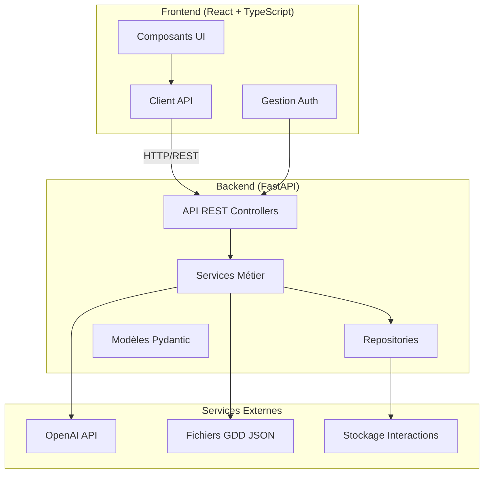

# Plan : Version Web - API REST FastAPI + Frontend React

## Architecture globale




## Structure du projet

```javascript
DialogueGenerator/
├── api/                          # Nouveau : API REST FastAPI
│   ├── __init__.py
│   ├── main.py                   # Point d'entrée FastAPI
│   ├── dependencies.py           # Injection de dépendances
│   ├── middleware.py             # Middleware (CORS, logging, errors)
│   ├── routers/                  # Routeurs REST
│   │   ├── __init__.py
│   │   ├── auth.py              # Authentification
│   │   ├── dialogues.py         # Génération de dialogues
│   │   ├── interactions.py      # CRUD interactions
│   │   ├── context.py           # Contexte GDD
│   │   └── config.py            # Configuration
│   ├── schemas/                  # DTOs Pydantic (API layer)
│   │   ├── __init__.py
│   │   ├── auth.py
│   │   ├── dialogue.py
│   │   ├── interaction.py
│   │   └── context.py
│   ├── services/                # Services API (adaptateurs)
│   │   ├── __init__.py
│   │   ├── auth_service.py
│   │   └── api_dialogue_service.py
│   └── exceptions.py            # Exceptions API personnalisées
├── frontend/                     # Nouveau : Application React
│   ├── package.json
│   ├── tsconfig.json
│   ├── vite.config.ts
│   ├── src/
│   │   ├── main.tsx
│   │   ├── App.tsx
│   │   ├── api/                 # Client API
│   │   │   ├── client.ts
│   │   │   ├── auth.ts
│   │   │   ├── dialogues.ts
│   │   │   └── interactions.ts
│   │   ├── components/          # Composants UI
│   │   │   ├── layout/
│   │   │   ├── context/
│   │   │   ├── generation/
│   │   │   └── interactions/
│   │   ├── hooks/               # React hooks
│   │   ├── store/               # State management (Zustand/Redux)
│   │   ├── types/               # Types TypeScript
│   │   └── utils/
│   └── public/
├── services/                     # Existant : Réutilisé tel quel
├── models/                       # Existant : Réutilisé tel quel
├── context_builder.py            # Existant : Réutilisé tel quel
├── prompt_engine.py              # Existant : Réutilisé tel quel
└── requirements.txt             # Ajout FastAPI, uvicorn, etc.
```


## Principes SOLID appliqués

### Single Responsibility Principle (SRP)

- **Routers** : Gestion des routes HTTP uniquement
- **Services API** : Adaptation entre couche API et services métier
- **Services métier** : Logique métier pure (déjà respecté)
- **Repositories** : Accès aux données uniquement

### Open/Closed Principle (OCP)

- Interfaces pour les repositories (déjà en place)
- Extension via nouveaux routers sans modifier l'existant
- Stratégies de génération extensibles

### Liskov Substitution Principle (LSP)

- Repositories interchangeables (InMemory vs File)
- Clients LLM interchangeables (OpenAI vs Dummy)

### Interface Segregation Principle (ISP)

- Interfaces spécifiques par responsabilité
- Pas de dépendances vers interfaces inutilisées

### Dependency Inversion Principle (DIP)

- Injection de dépendances via FastAPI Depends()
- Services dépendent d'abstractions, pas d'implémentations

## API REST - Design

### Versioning

- Préfixe `/api/v1/` pour toutes les routes
- Préparation pour v2 future

### Endpoints principaux

#### Authentification

```javascript
POST   /api/v1/auth/login          # Connexion
POST   /api/v1/auth/logout         # Déconnexion
POST   /api/v1/auth/refresh        # Rafraîchir token
GET    /api/v1/auth/me             # Utilisateur courant
```


#### Génération de dialogues

```javascript
POST   /api/v1/dialogues/generate/variants      # Générer variantes texte
POST   /api/v1/dialogues/generate/interactions  # Générer interactions structurées
GET    /api/v1/dialogues/estimate-tokens         # Estimer tokens
```


#### Interactions (CRUD)

```javascript
GET    /api/v1/interactions                     # Liste interactions
GET    /api/v1/interactions/{id}                # Détails interaction
POST   /api/v1/interactions                     # Créer interaction
PUT    /api/v1/interactions/{id}                # Mettre à jour
DELETE /api/v1/interactions/{id}                # Supprimer
GET    /api/v1/interactions/{id}/parents        # Interactions parentes
GET    /api/v1/interactions/{id}/children       # Interactions enfants
```


#### Contexte GDD

```javascript
GET    /api/v1/context/characters               # Liste personnages
GET    /api/v1/context/characters/{name}        # Détails personnage
GET    /api/v1/context/locations                # Liste lieux
GET    /api/v1/context/locations/{name}          # Détails lieu
GET    /api/v1/context/items                    # Liste objets
GET    /api/v1/context/build                    # Construire contexte personnalisé
POST   /api/v1/context/estimate-tokens          # Estimer tokens contexte
```


#### Configuration

```javascript
GET    /api/v1/config/llm                      # Config LLM
PUT    /api/v1/config/llm                      # Mettre à jour config LLM
GET    /api/v1/config/llm/models                # Modèles disponibles
GET    /api/v1/config/context                  # Config contexte
```


### Codes de statut HTTP

- `200 OK` : Succès
- `201 Created` : Ressource créée
- `204 No Content` : Succès sans contenu
- `400 Bad Request` : Requête invalide
- `401 Unauthorized` : Non authentifié
- `403 Forbidden` : Non autorisé
- `404 Not Found` : Ressource introuvable
- `422 Unprocessable Entity` : Validation échouée
- `500 Internal Server Error` : Erreur serveur

### Format des réponses

**Succès :**

```json
{
  "data": { ... },
  "meta": {
    "timestamp": "2025-12-25T14:00:00Z",
    "request_id": "uuid"
  }
}
```

**Erreur :**

```json
{
  "error": {
    "code": "VALIDATION_ERROR",
    "message": "Message d'erreur lisible",
    "details": { ... },
    "request_id": "uuid"
  }
}
```


## Authentification

### Stratégie : JWT (JSON Web Tokens)

- **Access Token** : Court terme (15 min), dans Authorization header
- **Refresh Token** : Long terme (7 jours), dans httpOnly cookie
- **Storage** : Access token en mémoire frontend, refresh token en cookie

### Implémentation

- `python-jose` pour JWT
- `passlib` pour hashage mots de passe
- `python-multipart` pour form data
- Middleware d'authentification FastAPI

### Sécurité

- HTTPS obligatoire en production
- CORS configuré strictement
- Rate limiting sur endpoints sensibles
- Validation stricte des inputs
- Protection CSRF (si sessions)

## Validation et gestion d'erreurs

### Validation

- **Pydantic** pour validation automatique des schémas
- Validation côté API (schemas) et côté métier (models)
- Messages d'erreur clairs et structurés

### Gestion d'erreurs

- Exceptions personnalisées hiérarchisées
- Handler global d'exceptions FastAPI
- Logging structuré avec contexte
- Pas d'exposition de détails internes en production

## Implémentation détaillée

### Phase 1 : Backend API (2 jours)

#### Jour 1.1 : Structure de base

1. **Créer `api/main.py`**

- Configuration FastAPI
- Middleware (CORS, logging, errors)
- Inclusion des routers
- Health check endpoint

2. **Créer `api/dependencies.py`**

- Injection de dépendances (ContextBuilder, services)
- Factory pour LLM clients
- Gestion du cycle de vie des services

3. **Créer `api/exceptions.py`**

- `APIException` (base)
- `ValidationException`
- `AuthenticationException`
- `NotFoundException`
- Handler global

4. **Créer `api/middleware.py`**

- CORS middleware
- Request logging
- Error handling
- Request ID generation

#### Jour 1.2 : Routers et schémas

1. **Créer `api/schemas/`**

- DTOs pour toutes les entités
- Validation Pydantic
- Conversion depuis/vers modèles métier

2. **Créer `api/routers/auth.py`**

- Endpoints authentification
- Service d'authentification
- Gestion JWT

3. **Créer `api/routers/dialogues.py`**

- Endpoints génération
- Adaptation DialogueGenerationService
- Gestion async/await

4. **Créer `api/routers/interactions.py`**

- CRUD complet
- Endpoints relations (parents/enfants)
- Validation et erreurs

5. **Créer `api/routers/context.py`**

- Endpoints GDD
- Construction contexte
- Estimation tokens

6. **Créer `api/routers/config.py`**

- Configuration LLM
- Modèles disponibles

### Phase 2 : Frontend React (1.5 jours)

#### Jour 2.1 : Structure et API Client

1. **Initialiser projet React + TypeScript + Vite**

- Configuration TypeScript stricte
- ESLint + Prettier
- Structure de dossiers

2. **Créer `frontend/src/api/client.ts`**

- Client HTTP (axios ou fetch)
- Intercepteurs (auth, errors)
- Types TypeScript

3. **Créer `frontend/src/api/` modules**

- `auth.ts` : Endpoints auth
- `dialogues.ts` : Endpoints dialogues
- `interactions.ts` : Endpoints interactions
- `context.ts` : Endpoints contexte

4. **Créer `frontend/src/types/`**

- Types TypeScript correspondant aux schémas API
- Génération depuis OpenAPI (optionnel)

#### Jour 2.2 : Composants UI

1. **Layout principal**

- Header avec auth
- Navigation
- Structure 3 panneaux (comme desktop)

2. **Composants contexte**

- Liste personnages/lieux avec filtres
- Sélection multiple
- Détails éléments

3. **Composants génération**

- Formulaire génération
- Paramètres (k, modèle, température)
- Affichage variantes
- Estimation tokens

4. **Composants interactions**

- Liste interactions
- Éditeur interaction
- Visualisation arborescence

5. **State management**

- Zustand ou Context API
- Gestion état auth
- Cache données

### Phase 3 : Intégration et tests (1 jour)

#### Jour 3.1 : Intégration

1. **Connecter frontend/backend**

- Tests end-to-end manuels
- Ajustements API si nécessaire
- Gestion erreurs frontend

2. **Tests backend**

- Tests unitaires routers
- Tests intégration API
- Tests authentification

3. **Tests frontend**

- Tests composants (React Testing Library)
- Tests hooks
- Tests API client (mocks)

### Phase 4 : Déploiement (0.5 jour)

#### Jour 4.1 : Configuration production

1. **Configuration SmarterASP.net**

- Déploiement FastAPI
- Variables d'environnement
- Configuration serveur

2. **Déploiement frontend**

- Build production
- Configuration serveur statique
- Intégration avec API

3. **Documentation**

- OpenAPI/Swagger automatique
- README déploiement
- Guide utilisateur

## Fichiers clés à créer

### Backend

- `api/main.py` : Application FastAPI principale
- `api/dependencies.py` : Injection de dépendances
- `api/routers/dialogues.py` : Endpoints génération
- `api/schemas/dialogue.py` : DTOs génération
- `api/services/api_dialogue_service.py` : Adaptateur service métier

### Frontend

- `frontend/src/api/client.ts` : Client HTTP
- `frontend/src/components/GenerationPanel.tsx` : Panneau génération
- `frontend/src/hooks/useDialogueGeneration.ts` : Hook génération
- `frontend/src/store/authStore.ts` : Store authentification

## Bonnes pratiques appliquées

1. **RESTful** : Ressources, méthodes HTTP appropriées, codes de statut
2. **Validation** : Pydantic côté backend, TypeScript côté frontend
3. **Sécurité** : JWT, HTTPS, CORS, validation inputs
4. **Logging** : Structuré avec contexte (request ID, user ID)
5. **Documentation** : OpenAPI/Swagger automatique
6. **Tests** : Unitaires, intégration, e2e
7. **Error handling** : Centralisé, messages clairs
8. **Performance** : Async/await, cache si nécessaire
9. **Maintenabilité** : SOLID, séparation des responsabilités
10. **Versioning** : API versionnée dès le départ

## Dépendances à ajouter

### Backend (`requirements.txt`)

```javascript
fastapi>=0.104.0
uvicorn[standard]>=0.24.0
python-jose[cryptography]>=3.3.0
passlib[bcrypt]>=1.7.4
python-multipart>=0.0.6
pydantic-settings>=2.0.0
```


### Frontend (`package.json`)

```json
{
  "dependencies": {
    "react": "^18.2.0",
    "react-dom": "^18.2.0",
    "typescript": "^5.2.0",
    "axios": "^1.6.0",
    "zustand": "^4.4.0",
    "react-router-dom": "^6.20.0"
  }
}
```


## Points d'attention

1. **Réutilisation services** : Les services existants (`DialogueGenerationService`, `ContextBuilder`, etc.) sont utilisés directement, pas réécrits
2. **Authentification** : À implémenter proprement dès le départ
3. **Gestion async** : FastAPI gère déjà l'async, s'assurer que les appels LLM restent async
4. **CORS** : Configurer correctement pour le frontend
5. **Validation** : Double validation (API + métier) pour sécurité
6. **Tests** : Couvrir les cas critiques (génération, auth, erreurs)

## Métriques de succès

- API RESTful complète et documentée
- Frontend fonctionnel avec toutes les fonctionnalités desktop
- Authentification sécurisée