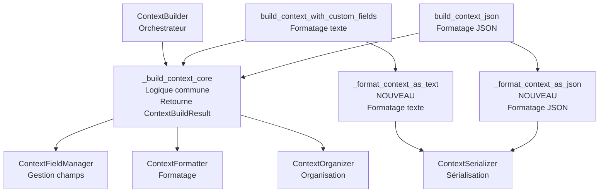

# Plan de Refactorisation - Piste 3 : Unification des méthodes build + extraction ContextFieldManager

## Objectif

Unifier `build_context_with_custom_fields()` et `build_context_json()` en éliminant la duplication restante et en améliorant la structure des données intermédiaires. Finaliser l'extraction de `ContextFieldManager` si nécessaire.

## État Actuel

**Déjà implémenté** :
- ✅ `_build_context_core()` existe et est utilisé par les deux méthodes
- ✅ `ContextFieldManager` existe avec les méthodes principales (`get_field_config_for_mode`, `filter_fields_by_condition_flags`, `get_field_labels_map`)
- ✅ Les deux méthodes build utilisent déjà `_build_context_core()`

**À améliorer** :
- **Duplication dans le formatage final** : Les deux méthodes ont encore de la logique de formatage qui pourrait être extraite
- **Structure intermédiaire** : `ElementBuildResult`/`CategoryBuildResult`/`ContextBuildResult` fonctionnent mais pourraient être mieux documentées
- **Séparation des responsabilités** : Le formatage texte vs JSON pourrait être mieux séparé

## Architecture Cible

## Phases de Refactorisation

### Phase 1 : Analyse et amélioration de la structure intermédiaire (1h)

**Objectif** : Vérifier et améliorer les structures de données intermédiaires existantes.

**Fichiers modifiés** :
- `context_builder.py` : Améliorer la documentation de `ElementBuildResult`, `CategoryBuildResult`, `ContextBuildResult`

**Actions** :
1. Analyser l'utilisation actuelle de `ElementBuildResult`/`CategoryBuildResult`/`ContextBuildResult`
2. Vérifier si les structures sont optimales ou si des améliorations sont nécessaires
3. Améliorer la documentation des structures existantes avec des exemples
4. Vérifier qu'il n'y a pas de duplication inutile

**Tests** : Vérifier que tous les tests passent

---

### Phase 2 : Extraction de la logique de formatage final (2h)

**Objectif** : Extraire la logique de formatage texte et JSON dans des méthodes séparées pour éliminer la duplication.

**Fichiers modifiés** :
- `context_builder.py` : Créer `_format_context_as_text()` et `_format_context_as_json()`

**Méthodes à créer** :

1. `_format_context_as_text(build_result: ContextBuildResult, include_element_markers: bool, max_tokens: int) -> str`
   - Extrait la logique de formatage texte depuis `build_context_with_custom_fields()` (lignes 729-759)
   - Gère les marqueurs explicites (`--- PNJ 1 ---`, etc.)
   - Gère la troncature finale
   - Retourne le texte formaté

2. `_format_context_as_json(build_result: ContextBuildResult, organization_mode: str) -> PromptStructure`
   - Extrait la logique de construction JSON depuis `build_context_json()` (lignes 803-850)
   - Construit les sections `PromptSection`
   - Construit les catégories `ContextCategory`
   - Calcule les tokens
   - Retourne `PromptStructure`

**Actions** :
1. Créer `_format_context_as_text()` en extrayant la logique depuis `build_context_with_custom_fields()`
2. Créer `_format_context_as_json()` en extrayant la logique depuis `build_context_json()`
3. Simplifier `build_context_with_custom_fields()` pour appeler `_build_context_core()` puis `_format_context_as_text()`
4. Simplifier `build_context_json()` pour appeler `_build_context_core()` puis `_format_context_as_json()`

**Tests** :
- Créer des tests unitaires pour `_format_context_as_text()` et `_format_context_as_json()`
- Vérifier que tous les tests existants passent

---

### Phase 3 : Finalisation de ContextFieldManager (1h)

**Objectif** : Vérifier que `ContextFieldManager` est complètement extrait et optimisé.

**Fichiers modifiés** :
- `services/context_field_manager.py` : Vérifier et améliorer si nécessaire
- `context_builder.py` : Vérifier qu'il n'y a plus de logique de champs en interne

**Actions** :
1. Vérifier que toute la logique de gestion des champs est dans `ContextFieldManager`
2. Vérifier la dépendance avec `ContextFieldValidator` (éviter les dépendances circulaires)
3. Améliorer la documentation de `ContextFieldManager` avec des exemples
4. Optimiser les méthodes si nécessaire (cache, performance)
5. Vérifier qu'il n'y a pas de méthodes privées dans `ContextBuilder` qui gèrent les champs

**Tests** :
- Vérifier que tous les tests passent
- Vérifier les tests de `ContextFieldManager` (`tests/services/test_context_field_manager.py`)

---

### Phase 4 : Simplification de _build_context_core (1h)

**Objectif** : Simplifier `_build_context_core()` en utilisant mieux les services et en améliorant la lisibilité.

**Fichiers modifiés** :
- `context_builder.py`

**Actions** :
1. Vérifier que tous les appels aux services sont optimaux
2. Simplifier les vérifications conditionnelles si possible (utiliser des expressions ternaires cohérentes)
3. Améliorer la documentation et les commentaires
4. Réduire la complexité cyclomatique si possible
5. Vérifier qu'il n'y a pas de logique métier qui devrait être dans un service

**Tests** : Vérifier que tous les tests passent, notamment `test_context_builder.py` et `test_context_builder_real_data.py`

---

### Phase 5 : Tests et validation (1h)

**Objectif** : Valider le refactoring complet.

**Actions** :
1. Exécuter tous les tests existants
2. Vérifier la couverture de code
3. Valider les performances (pas de régression)
4. Comparer les sorties avant/après pour validation manuelle (texte et JSON)

**Tests** :
- `pytest tests/test_context_builder.py -v`
- `pytest tests/test_prompt_structure.py -v`
- `pytest tests/api/test_context.py -v`
- `pytest tests/services/test_context_field_manager.py -v`

---

## Métriques de Succès

### Avant
- **Duplication** : Logique de formatage dupliquée entre les deux méthodes build
- **Complexité** : Logique de formatage mélangée avec logique de construction
- **Maintenabilité** : Modifications nécessaires dans deux endroits pour changer le formatage

### Après
- **Duplication** : < 10% (uniquement les différences de format de sortie)
- **Complexité** : Logique de formatage séparée de la logique de construction
- **Maintenabilité** : Modifications dans un seul endroit (`_format_context_as_text()` ou `_format_context_as_json()`)
- **Testabilité** : Formatage texte et JSON testables séparément

### Validation
- ✅ Tous les tests existants passent (100%)
- ✅ Couverture de code maintenue ou améliorée
- ✅ Performance : pas de régression mesurable
- ✅ API publique conservée (pas de breaking changes)

---

## Risques et Mitigation

### Risque 1 : Changement de comportement dans le formatage

**Mitigation** :
- Tests exhaustifs avant/après
- Validation manuelle des sorties texte et JSON
- Comparaison des tokens générés
- Tests de régression pour chaque format

### Risque 2 : Performance dégradée

**Mitigation** :
- Profiling avant/après si nécessaire
- Les méthodes de formatage sont plus simples, donc potentiellement plus rapides
- Pas de création d'objets supplémentaires (réutilisation de `ContextBuildResult`)

### Risque 3 : Complexité de la structure intermédiaire

**Mitigation** :
- Documenter clairement les structures existantes
- Garder les structures si elles fonctionnent bien
- Simplifier uniquement si vraiment nécessaire

---

## Ordre d'Exécution

Les phases doivent être exécutées dans l'ordre car elles ont des dépendances :

1. Phase 1 (structure) → prépare le terrain et comprend l'existant
2. Phase 2 (formatage) → simplifie les méthodes build (impact principal)
3. Phase 3 (ContextFieldManager) → finalise l'extraction
4. Phase 4 (simplification core) → optimise le cœur
5. Phase 5 (validation) → finalisation

---

## Estimation Totale

- **Phase 1** : 1h
- **Phase 2** : 2h
- **Phase 3** : 1h
- **Phase 4** : 1h
- **Phase 5** : 1h
- **Total** : **6h**

---

## Checklist de Validation

### Avant de commencer
- [ ] Tous les tests existants passent (`pytest tests/`)
- [ ] Backup du code actuel (commit Git)
- [ ] Documentation à jour

### Après chaque phase
- [ ] Tests unitaires créés pour les nouvelles méthodes
- [ ] Tests d'intégration validés
- [ ] Code review à chaque phase majeure

### Après le refactoring
- [ ] Tous les tests passent (100%)
- [ ] Couverture de code maintenue ou améliorée
- [ ] Documentation mise à jour
- [ ] Performance validée (pas de régression)
- [ ] Code review final
- [ ] Métriques de succès atteintes

---

## Notes Importantes

1. **Compatibilité** : L'API publique de `ContextBuilder` doit rester inchangée
2. **Tests** : Ne pas supprimer les tests existants, les adapter si nécessaire
3. **Migration progressive** : Chaque phase peut être commitée séparément pour faciliter le rollback
4. **Documentation** : Mettre à jour les docstrings et commentaires après chaque phase
5. **Structures existantes** : `ElementBuildResult`/`CategoryBuildResult`/`ContextBuildResult` fonctionnent bien, les garder si possible

---

## Références

- `context_builder.py` : Fichier principal à refactoriser
- `services/context_field_manager.py` : Service de gestion des champs
- `services/context_organizer.py` : Utilisé par `_build_context_core()`
- `models/prompt_structure.py` : Structures JSON utilisées
- `tests/test_context_builder.py` : Tests existants à valider
- `docs/REFACTORING_PISTES_2_3.md` : Documentation existante sur les pistes 2 et 3
