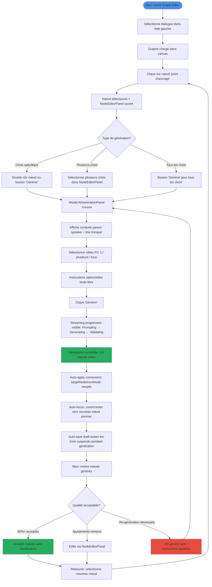

```mermaid
flowchart TD
    Start([Mathieu ouvre Graph Editor]) --> SelectDialogue[Sélectionne dialogue dans liste gauche]
    
    SelectDialogue --> NeedHelp{Besoin d'aide?}
    
    NeedHelp -->|Oui| GuideRapide[Bouton 'Guide rapide' dans toolbar → Ouvre wizard optionnel]
    NeedHelp -->|Non| LoadGraph[Graphe chargé dans canvas]
    
    GuideRapide --> Step1[Step 1: Quel lieu? → Tape 'Taverne' → Liste filtrée]
    Step1 --> Step2[Step 2: Quel personnage? → Sélectionne NPC]
    Step2 --> Step3[Step 3: Contexte ou thème? → Écrit 'Légende Avili']
    Step3 --> Step4[Step 4: Instructions spéciales? → Template pré-rempli]
    Step4 --> GenerateFirst[Génère 1er nœud de dialogue]
    
    GenerateFirst --> LoadGraph
    LoadGraph --> ViewGraph[Visualise structure dialogue dans graphe]
    
    ViewGraph --> SelectNode[Clique sur nœud pour continuer]
    SelectNode --> NodeSelected[Nœud sélectionné + NodeEditorPanel ouvert]
    
    NodeSelected --> GuidedMode{Mode guidé activé?}
    
    GuidedMode -->|Oui| GuidedFlow[Suggestions contextuelles affichées]
    GuidedMode -->|Non| StandardFlow[Workflow standard comme Marc]
    
    GuidedFlow --> SuggestChoices[Système suggère choix PJ pertinents]
    SuggestChoices --> MathieuSelects[Mathieu sélectionne choix ou crée nouveau]
    MathieuSelects --> GenerateNext[Génère nœud suivant]
    
    GenerateNext --> AutoConnect[Auto-connect + auto-focus]
    AutoConnect --> QualityCheck{Qualité acceptable?}
    
    QualityCheck -->|Oui| Continue[Continue génération itérative]
    QualityCheck -->|Non| LLMJudge[LLM Judge suggère améliorations V1.5]
    
    Continue --> BatchGenerate[Génère batch pour tous les choix]
    BatchGenerate --> ReviewAll[Review tous les nœuds générés]
    ReviewAll --> Export[Export Unity validé]
    
    LLMJudge --> ApplySuggestions[Applique suggestions ou ignore]
    ApplySuggestions --> Continue
    
    Export --> Success[Succès: Dialogue complet en 1H30]
    
    StandardFlow --> SelectNode
    
    style Start fill:#4A90E2
    style GuideRapide fill:#F5A623
    style GenerateFirst fill:#27AE60
    style Success fill:#27AE60
    style LLMJudge fill:#229954
```

# User Journey Flows

## Journey 1: Marc - Power User "Generate Next"

**Flow principal :** Génération itérative rapide avec contrôle total

**Objectif :** Produire des dialogues de qualité Disco Elysium scale en maximisant le contrôle créatif et la vitesse de production.

**Flow détaillé :**

**Points d'optimisation :**
- **Minimiser les clics** : Double-clic nœud → modal directement (1 clic au lieu de 2-3)
- **Feedback visuel** : Streaming progression visible, auto-focus sur résultat
- **Récupération d'erreur** : Fallback multi-provider LLM si API down (0 friction)

**Moment critique :** Batch generation 8 nœuds en 90 secondes → 6/8 acceptés immédiatement, 2/8 ajustements mineurs

## Journey 2: Mathieu - Writer Occasionnel "Workflow Guidé"

**Flow principal :** Autonomie rapide avec guidance minimale

**Objectif :** Produire un dialogue de qualité rapidement (1-2H max) sans support technique externe.

**Flow détaillé :**

**Points d'optimisation :**
- **Interface auto-explicative** : Tooltips contextuels, labels clairs, pas de wizard automatique
- **Guide rapide optionnel** : Bouton "Guide rapide" dans toolbar pour ouvrir wizard si besoin
- **Guidance contextuelle** : Suggestions intelligentes pour réduire hésitation (mode guidé optionnel)
- **Auto-save** : Récupération automatique si navigateur fermé accidentellement

**Moment critique :** "Connect-the-dots" automatique : Taverne → Avili → Nids-Cités (l'IA comprend les liens sans explication)

## Journey Patterns

**Navigation Patterns :**
- **Sélection dialogue → Chargement graphe → Sélection nœud → Génération** : Flow principal répété en boucle
- **Double-clic nœud = raccourci vers génération** : Réduction friction (1 clic au lieu de 2-3)
- **Auto-focus après génération** : Maintien du contexte visuel (pas de recherche manuelle)

**Decision Patterns :**
- **Choix unique vs batch** : Toggle dans modal (flexibilité selon besoin)
- **Mode guidé vs power** : Détection automatique ou toggle manuel (adaptation skill level)
- **Qualité acceptable** : Acceptation immédiate vs édition vs re-génération (décision rapide)

**Feedback Patterns :**
- **Streaming progression** : Transparence temps réel (Prompting → Generating → Validating)
- **Auto-connect + auto-focus** : Confirmation visuelle immédiate (ça marche tout seul)
- **Validation errors** : Panel overlay avec zoom sur erreurs (pas de recherche manuelle)

## Flow Optimization Principles

**Minimiser steps to value :**
- **Double-clic nœud → modal directement** : 1 clic au lieu de 2-3 (réduction friction)
- **Auto-apply connexions** : Pas de configuration manuelle (efficacité)
- **Auto-focus** : Pas de recherche manuelle du nouveau nœud (maintien contexte)

**Réduire cognitive load :**
- **Mode guidé** : Suggestions contextuelles pour Mathieu (réduction hésitation)
- **Templates pré-remplis** : Réduction saisie manuelle (efficacité)
- **Progressive disclosure** : Détails au besoin (infobulles, expand) (réduction clutter)

**Créer moments de satisfaction :**
- **Streaming visible** : Feedback immédiat (pas d'attente muette)
- **Auto-connect** : "Ça marche tout seul" (magie visible)
- **Batch generation** : "8 nœuds en 90 secondes" (efficacité palpable)

**Gestion erreurs gracieuse :**
- **Fallback multi-provider** : 0 friction si API down (résilience)
- **Auto-save** : Récupération automatique session (sécurité)
- **Validation errors** : Zoom direct sur problème (pas de recherche manuelle)
