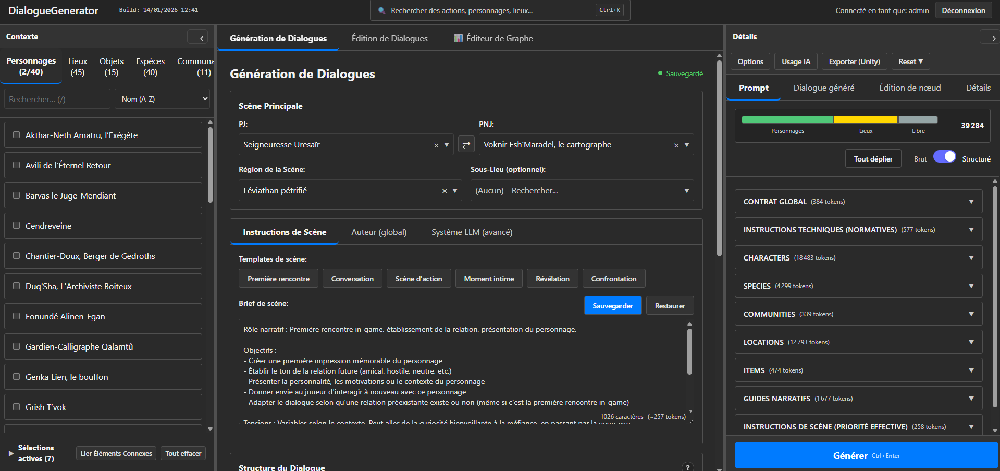
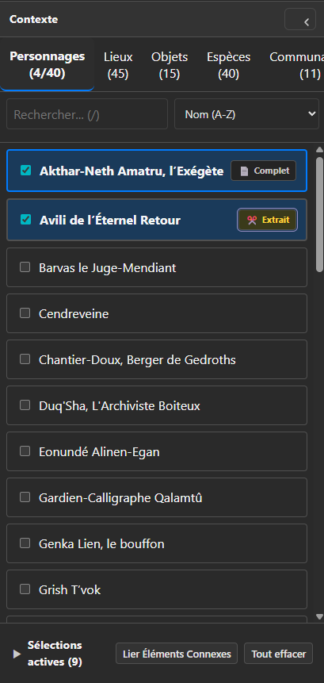
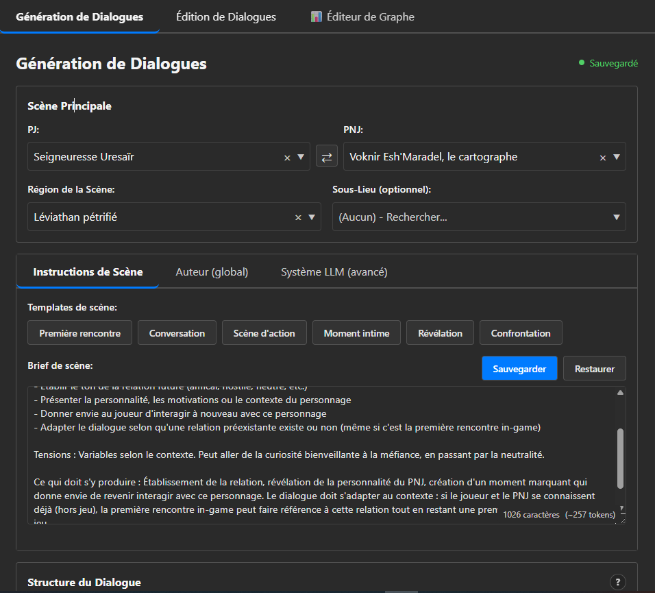
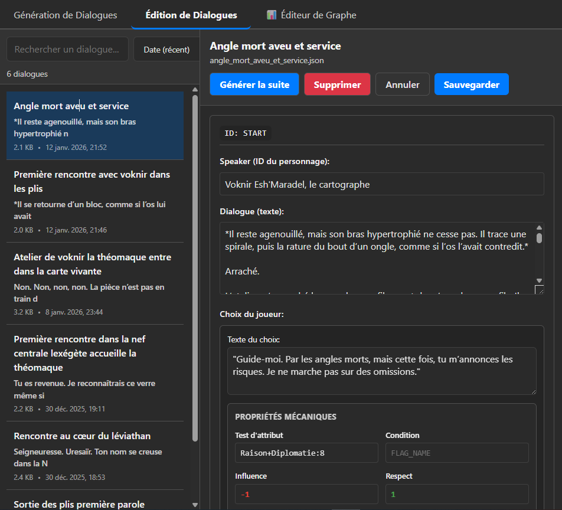
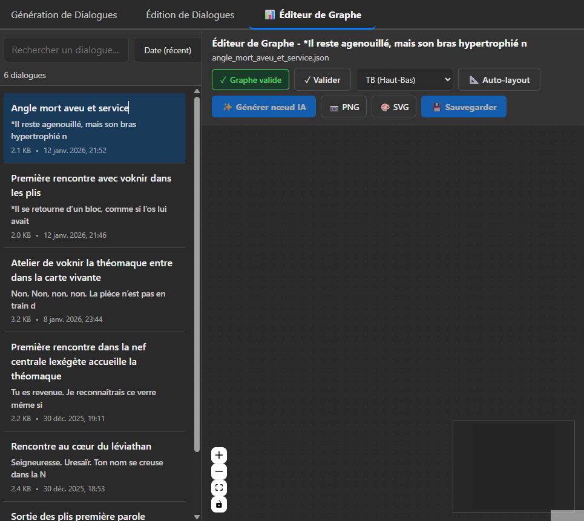
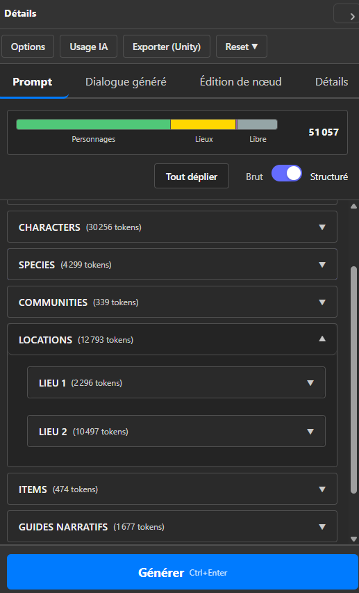
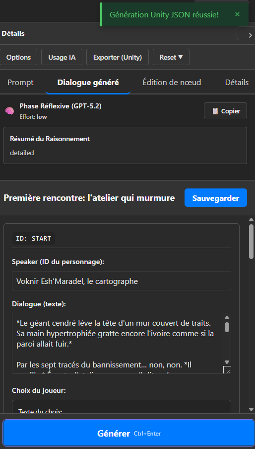
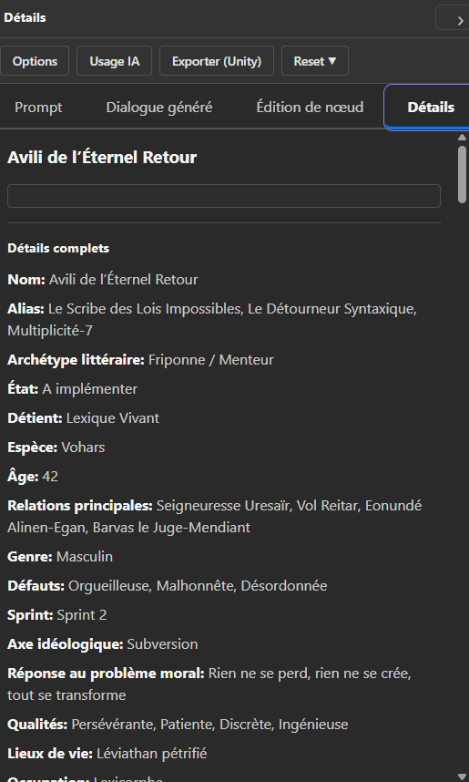

# Structure de l'Interface Actuelle - DialogueGenerator

**Date:** 2026-01-14  
**Auteur:** Sally (UX Designer)  
**Statut:** Documentation de référence

---

## Vue d'Ensemble

L'interface DialogueGenerator est une **Single Page Application (SPA) React** organisée en **3 colonnes verticales principales** :

1. **Colonne Gauche : Contexte** (panneau sélection ressources)
2. **Colonne Centrale : Génération de Dialogues** (espace de travail principal)
3. **Colonne Droite : Détails** (informations prompt, génération, export)

---

## Layout Global

### Header (barre supérieure)

- **Titre application** : "DialogueGenerator" + build info (date/heure)
- **Recherche globale** : "Rechercher des actions, personnages, lieux..." (Ctrl+K)
- **Navigation principale** : 3 onglets
  - "Génération de Dialogues" (actif par défaut)
  - "Édition de Dialogues"
  - "Éditeur de Graphe"
- **Statut utilisateur** : "Connecté en tant que: admin" + bouton "Déconnexion"

---

## Colonne Gauche : Contexte

**Fonction :** Sélection et gestion des ressources GDD (personnages, lieux, objets, etc.)

**Composants :**
- **Titre** : "Contexte" (collapsible)
- **Onglets de catégories** :
  - Personnages (2/40) - indique sélections/total
  - Lieux (45)
  - Objets (15)
  - Espèces (40)
  - Communautés (11)
- **Recherche par catégorie** : Input "Rechercher... (/)"
- **Tri** : Dropdown "Nom (A-Z)"
- **Liste d'items** : Scrollable avec checkboxes pour sélection
- **Footer** :
  - "Sélections actives (7)" (compteur total)
  - Bouton "Lier Éléments Connexes"
  - Bouton "Tout effacer"

**Comportement :**
- Recherche et tri par catégorie active
- Sélections persistées (affichées dans compteur global)
- Onglets = navigation séquentielle (friction identifiée pour V1.5)

---

## Colonne Centrale : Génération de Dialogues

**Fonction :** Configuration et génération de dialogues (espace de travail principal)

### En-tête
- **Titre** : "Génération de Dialogues"
- **Statut** : "• Sauvegardé" (indicateur vert)

### Section "Scène Principale"
- **PJ (Player Character)** : Dropdown (ex: "Seigneuresse Uresäir")
- **PNJ (Non-Player Character)** : Dropdown (ex: "Voknir Esh'Maradel, le cartographe")
  - Bouton swap (double flèche) entre PJ/PNJ
- **Région de la Scène** : Dropdown (ex: "Léviathan pétrifié")
- **Sous-Lieu (optionnel)** : Dropdown "(Aucun) - Rechercher..."

### Section "Instructions de Scène"
- **Sous-onglets** :
  - "Instructions de Scène" (actif)
  - "Auteur (global)"
  - "Système LLM (avancé)"
- **Templates de scène** : 7 boutons
  - "Première rencontre" (actif)
  - "Conversation"
  - "Scène d'action"
  - "Moment intime"
  - "Révélation"
  - "Confrontation"
- **Brief de scène** : Textarea large
  - Contenu : Rôle narratif + Objectifs
  - Compteur : "1026 caractères (~257 tokens)"
  - Actions : Boutons "Sauvegarder" + "Restaurer"
- **Structure du Dialogue** : Section (collapsed)

**Notes :**
- Les boutons "Sauvegarder"/"Restaurer" dans "Brief de scène" concernent le brief, pas des presets globaux
- Workflow actuel = 10+ clics pour générer un premier dialogue (Cold Start Problem)

### Vues Alternatives de la Colonne Centrale

L'interface propose deux autres vues principales accessibles via les onglets de navigation :

**Vue "Édition de Dialogues" :**

- Liste de dialogues à gauche (recherche, tri par date)
- Éditeur de dialogue à droite (ID, Speaker, texte, choix joueur, propriétés mécaniques)
- Actions : Générer la suite, Supprimer, Annuler, Sauvegarder

**Vue "Éditeur de Graphe" :**

- Liste de dialogues à gauche (même que vue Édition)
- Canvas de graphe à droite (React Flow)
- Actions : Validation, Auto-layout, Génération nœud IA, Export PNG/SVG, Sauvegarder

---

## Colonne Droite : Détails

**Fonction :** Affichage prompt, résultat génération, export Unity

**Largeur :** Panneau étroit (~340px)

### Actions globales (barre supérieure)
- Boutons : "Options", "Usage IA", "Exporter (Unity)", "Reset ▼"

### Sous-onglets
- **"Prompt"** (actif par défaut)
- "Dialogue généré"
- "Édition de nœud"
- "Détails"

### Onglet "Prompt" (affichage détaillé)

**Token usage bar :**
- Barre horizontale segmentée (couleurs)
  - Vert : "Personnages"
  - Jaune : "Lieux"
  - Bleu : "Libre"
- Total : "39 284 tokens" affiché

**Options d'affichage :**
- Bouton "Tout déplier"
- Toggle "Brut / Structuré" (actif : "Structuré")

**Sections collapsibles** (accordion) :
- "CONTRAT GLOBAL (384 tokens)"
- "INSTRUCTIONS TECHNIQUES (NORMATIVES) (577 tokens)"
- "CHARACTERS (18483 tokens)"
- "SPECIES (4299 tokens)"
- "COMMUNITIES (339 tokens)"
- "LOCATIONS (12793 tokens)"
- "ITEMS (474 tokens)"
- "GUIDES NARRATIFS (1677 tokens)"
- "INSTRUCTIONS DE SCÈNE (PRIORITÉ EFFECTIVE) (258 tokens)"

**Bouton principal :**
- "Générer Ctrl+Enter" (grand bouton bleu en bas)

### Onglet "Dialogue généré" (résultat génération)

- **Phase Réflexive** : Résumé du raisonnement LLM (GPT-5.2)
- **Titre du dialogue généré**
- **Champs éditable** : ID, Speaker, Dialogue (texte), Choix du joueur
- **Actions** : Sauvegarder, Générer (pour continuer)
- **Notification** : Bannière de succès pour export Unity JSON

### Onglet "Détails" (fiche complète)

- **Affichage détaillé d'une fiche** (personnage, lieu, objet, etc.)
- **Tous les attributs** : Nom, Alias, Archétype, Statut, Espèce, Âge, Relations, Qualités, Défauts, etc.
- **Scrollable** : Section "Détails complets" avec scrollbar

**Notes :**
- Panneau étroit = contraint pour afficher feedback génération (d'où popup modal recommandée)
- Token count visible = bonne pratique pour transparence coûts
- Multi-onglets dans Détails = organisation claire mais nécessite navigation

---

## Patterns d'Interaction Identifiés

### Navigation
- **Onglets principaux** : Changement de vue (Génération / Édition / Graphe)
- **Sous-onglets** : Navigation dans panneau (Instructions / Auteur / Système LLM)
- **Onglets contexte** : Navigation séquentielle entre catégories (friction V1.5)

### Feedback
- **Statut sauvegarde** : "Sauvegardé" (vert) = rassurant
- **Compteurs** : "Sélections actives (7)", tokens, caractères
- **Pas de feedback génération** : Problème identifié pour V1.0

### Workflow Actuel
1. Sélection contexte (personnages, lieux, etc.) - 5-7 clics (changements d'onglets)
2. Configuration scène (PJ, PNJ, région, sous-lieu) - 3-4 clics
3. Instructions scène (brief, templates) - 2-3 clics
4. Clic "Générer" → Attente (pas de feedback)
5. Résultat dans onglet "Dialogue généré"

**Friction principale :** Cold Start (10+ clics) + pas de feedback pendant génération

---

## Points d'Attention pour V1.0

### Améliorations Priorisées
1. **Progress Feedback** : Popup modal centrée (voir `wireframe-generation-modal-*.excalidraw`)
2. **Presets** : Barre compacte au-dessus de "Scène Principale" (voir `wireframe-presets-placement-*.excalidraw`)

### Contraintes Identifiées
- **Panneau Détails étroit** : Ne permet pas d'afficher feedback génération intégré → popup recommandée
- **Navigation contexte** : Onglets séquentiels = friction (amélioration V1.5 avec recherche unifiée)

---

## Références

- Wireframes nouvelles features : `_bmad-output/excalidraw-diagrams/wireframe-*-*.excalidraw`
- Spécifications UX V1.0 : `docs/features/v1.0-ux-specs.md`
- Architecture frontend : `docs/architecture-frontend.md`
- PRD : `_bmad-output/planning-artifacts/prd.md`
- Guide screenshots : `docs/features/SCREENSHOTS_TO_TAKE.md`
